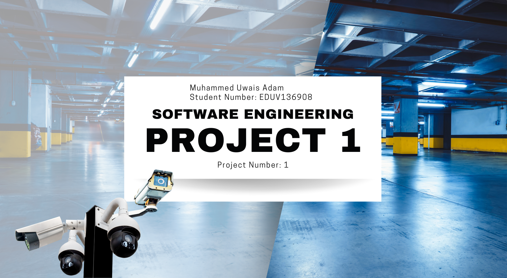

🚗 Parking Garage Management System

📌 Overview

This project presents the design of a Parking Garage Management System developed for Eduvos.
The system addresses inefficiencies in parking space usage and congestion by enabling parking reservations, real-time occupancy tracking, automated payments, and license plate recognition.

🎯 Problem Statement

Eduvos required a system to:

Reduce congestion inside parking garages

Improve parking space utilization

Allow users to reserve parking in advance

Track vehicles entering and exiting the garage automatically

👥 Actors

Client

Eduvos Website

License Plate Reader

Parking Sensors

Payment Processor

🔧 Core Features

Reserve daily or monthly parking

Find available parking spots using sensors

License plate recognition on entry and exit

Online payments for registered users

Manual payment for unregistered users

Automatic overtime charge calculation

Email notifications and receipts

Temporary license plate handling for borrowed vehicles

📐 System Diagrams
Use Case Diagram

Shows all system interactions between actors and the system.

Activity Diagram

Illustrates the full reservation-to-exit workflow using UML swimlanes.

Class Diagram

Defines system structure including:

Parking Garage

System

Reservation

User

Vehicle (including borrowed vehicles)

Payment

Sensors

Cameras

Database

State Machine Diagram

Models the lifecycle of an account from creation to booking confirmation or cancellation.

All diagrams are available in the /diagrams folder.

🧠 Software Development Methodology

The system was designed using Rapid Application Development (RAD) due to:

Fast prototyping

User-centric design

Flexibility for future changes

Reduced development risk

Additional methodologies discussed:

Agile

Scrum

DevOps

Feature-Driven Development (FDD)

🛠 Tools & Concepts Used

UML (Use Case, Activity, Class, State Machine diagrams)

Object-Oriented Design

Software Engineering principles

Requirements analysis

System modeling

📈 Future Improvements

Web-based frontend implementation

Real-time dashboard for administrators

Mobile application integration

Multi-campus support

Integration with real parking hardware APIs

👤 Author

Muhammed Uwais Adam
Software Engineering | Systems Design | Database & ML Enthusiast
